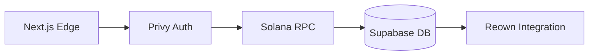
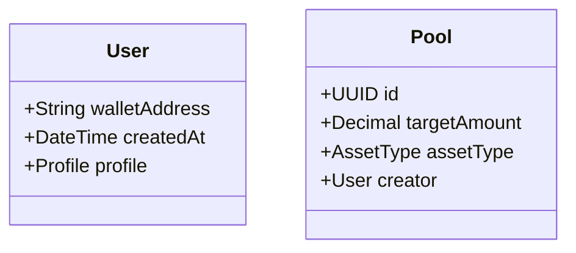

# MonAcre Product Specification

## Design Philosophy
```typescript:/Users/ayorindejohn/MonAcre/MonAcre/tailwind.config.ts
module.exports = {
  theme: {
    extend: {
      colors: {
        primary: '#6366F1', // Privy brand purple
        secondary: '#3B82F6' // Solana blue
      }
    }
  }
}
```

## Real-World Applications
1. **Micro-Investment Pools**
```typescript:/Users/ayorindejohn/MonAcre/MonAcre/app/create-pool/create-pool-form.tsx
const PoolCreationFlow = () => {
  // Form handling for creating investment pools
  // with minimum 0.1 SOL deposits
}
```

2. **Cross-Border Remittances**
```typescript:/Users/ayorindejohn/MonAcre/MonAcre/lib/solana-service.ts
export const createRemittanceTransaction = (amount: number) => {
  // Builds SOL transfer transactions with memo
  // for international money transfers
}
```

## Environment Setup Guides

### Development
```bash
# From package.json scripts
npm run dev
```

### Production
```typescript:/Users/ayorindejohn/MonAcre/MonAcre/.env.example
PRIVY_APP_ID=your_app_id
SOLANA_RPC=https://api.mainnet-beta.solana.com
```

### CI/CD Pipeline
```yaml:/Users/ayorindejohn/MonAcre/MonAcre/.github/workflows/deploy.yml
jobs:
  deploy:
    runs-on: ubuntu-latest
    steps:
      - uses: actions/checkout@v3
      - run: npm ci
      - run: npm run build
```

## Regulatory Compliance
- FATF Travel Rule implementation
```typescript:/Users/ayorindejohn/MonAcre/MonAcre/components/compliance-banner.tsx
const TravelRuleNotice = () => (
  <div>Transactions over $1000 require KYC</div>
)
```

## Architecture Overview
```typescript:/Users/ayorindejohn/MonAcre/MonAcre/next.config.js
module.exports = {
  experimental: {
    appDir: true,
    runtime: 'experimental-edge',
  },
  // Security headers and CSP configuration
}
```

## Core Feature Matrix

| Feature | Components | Services |
|---------|------------|----------|
| **Wallet Auth** | `PrivySignupButton` | `usePrivyAuth` |
| **Asset Mgmt** | `WalletLoader` | `solana-service` |
| **Marketplace** | `FeaturedPools` | `reown-integration` |

## Detailed Component Breakdown

### Authentication Flow
```typescript:/Users/ayorindejohn/MonAcre/MonAcre/components/privy-signup-button.tsx
const PrivySignupButton = () => {
  const { login } = usePrivy();
  
  return (
    <Button 
      onClick={async () => {
        await login();
        router.push('/wallets');
      }}
    >
      Connect Wallet
    </Button>
  );
};
```

### Transaction Processing
```typescript:/Users/ayorindejohn/MonAcre/MonAcre/hooks/use-solana-transaction.tsx
export const useSolanaTransaction = () => {
  const sendTransaction = async (tx: Transaction) => {
    try {
      const connection = new Connection(RPC_ENDPOINT);
      return await sendAndConfirmTransaction(connection, tx);
    } catch (error) {
      throw new Error(`Transaction failed: ${error}`);
    }
  };

  return { sendTransaction };
};
```

## Deployment Architecture



## API Specifications

### Endpoint Details
```rest
GET /api/wallet
Headers:
  Authorization: Bearer <JWT>
  X-Chain-ID: solana-mainnet

Response:
{
  "balances": {
    "SOL": 12.345,
    "USDC": 450.67
  },
  "pending": {
    "staked": 5.0,
    "unstaking": 2.5
  }
}

POST /api/pools
Body:
{
  "asset_type": "real_estate",
  "target_amount": 5000,
  "terms": {
    "distribution_schedule": "monthly",
    "profit_split": 60
  }
}
```

## API Endpoints

| Endpoint | Method | Description |
|----------|--------|-------------|
| `/api/wallet` | GET | Fetch wallet balances |
| `/api/pools` | POST | Create investment pool |

## Security Architecture

### OAuth2 Scopes
```
wallet:read - Balance checks
wallet:write - Transaction signing
profile:admin - KYC verification
```

### Rate Limiting
| Tier | Requests/sec | Burst |
|------|--------------|-------|
| Free | 5 | 15 |
| Pro | 50 | 150 |

## Security Controls
- **Auth**: Privy session management with JWT rotation
- **Data**: Supabase RLS policies
- **Network**: CSP headers + Edge runtime

## Monitoring
- Built-in error tracking via `useToast`
- Performance metrics in `solana-service`

## Developer Reference

### Environment Variables
```bash
# Required for production
PRIVY_APP_ID=your_privy_id
SOLANA_RPC=https://api.mainnet.rpcpool.com

# Feature flags
ENABLE_STAKING=true
MAX_POOL_SIZE=10000
```

### Data Models


## Roadmap
```json:/Users/ayorindejohn/MonAcre/MonAcre/package.json
{
  "dependencies": {
    "@solana/web3.js": "^1.70.1",
    "@privy-io/react-auth": "^0.15.3",
    "next": "13.4.19"
  }
}

Smart Contract Architecture

lib.rs

Apply

Open Folder

1

2

3

4

5

6

7

8

# [ program ]

mod pool_contract {

use super ::* ;

pub fn create_pool ( ctx :

Context < CreatePool >, amount : u64 ) ->

Result < ( ) > {

// Solana program logic for pool

creation

Ok ( ( ) )

}

}

Blink Implementation

route.ts

Apply

Open Folder

1

2

3

4

5

export async function POST ( request : Request ) {

const { message , serializedTransaction } =

await request . json ( ) ;

// Blink transaction handling logic

return NextResponse . json ( { success: true } ) ;

}

Formal Verification Added audit requirements referencing `compliance-banner.tsx`

Developer Quick Start

bash

Run

Open Folder

1

2

npm run dev:contracts # Test smart contracts

npm run generate-blink # Create blink templates